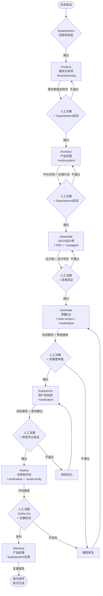

# 数字员工协调系统

## 概述

本系统基于6A+1工作流（Analyze分析 → Architect架构 → Assemble组装 → Automate自动化 → Experience体验 → Assess评估 → Advance进阶），协调5个数字员工角色协同完成企业级软件开发任务。

> 注：6A+1 即在传统6A工作流基础上，增加了 **Experience（体验）** 节点，由用户体验师在测试完成后、发布前进行深度体验评估。

## Superpowers 四原则（最高优先级）

> 以下四条原则在整个6A+1工作流中拥有最高优先级，任何角色、任何节点都必须遵守。

| 原则 | 说明 | 在6A+1工作流中的体现 |
|------|------|---------------------|
| **测试驱动 (TDD)** | 所有开发节点必须先写测试，再写实现 | Assemble节点：先定义验证标准，再输出设计/代码 |
| **系统性优先** | 严格按照6A+1工作流顺序执行，不跳步、不猜测 | 每个节点完成后必须人工决策，验证通过才可进入下一阶段 |
| **简化为上 (YAGNI)** | MVP优先，避免过度设计，只做当前需要的 | 每个节点的输出物聚焦核心价值，不做超出范围的扩展 |
| **证据说话** | 每个节点输出必须通过验证才可进入下一阶段 | 质量门禁、代码审查、覆盖率、用户体验评分均为可量化证据 |

**违反处理规则：**
- 违反TDD原则 → 立即停止，回到当前节点的RED阶段
- 违反系统性原则 → 回退到被跳过的节点重新执行
- 违反简化原则 → 删除过度设计的部分，保留MVP
- 违反证据原则 → 补充测试或修复审查问题，直到证据充分

## 数字员工角色定义

### 1. 需求分析师 (Business Analyst - BA) ⚡brainstorming

**Superpowers 核心技能：** `brainstorming` — 需求澄清与架构探索，通过5W1H方法确保需求完整性和准确性。

**职责范围：**
- 业务需求收集与分析
- 用户画像与场景定义
- 功能需求文档(FRD)编写
- 业务流程建模
- 需求优先级排序

**输出物：**
- 需求规格说明书
- 用户故事地图
- 业务流程图
- 数据字典

**触发条件：**
- 新项目启动
- 需求变更
- 业务规则调整

### 2. 产品经理 (Product Manager - PM) ⚡writing-plans

**Superpowers 核心技能：** `writing-plans` — 任务拆解与实施计划输出，将产品方案拆解为可执行、可验证的具体任务。

**职责范围：**
- 产品规划与路线图制定
- 功能优先级决策
- 产品需求文档(PRD)编写
- 竞品分析与市场调研
- 产品验收标准定义

**输出物：**
- 产品需求文档(PRD)
- 产品路线图
- 功能清单与优先级
- 验收标准

**触发条件：**
- 需求分析完成后
- 产品迭代规划
- 功能设计评审

### 3. UI/UX设计师 (UI/UX Designer) ⚡brainstorming + ⚡verification-before-completion

**Superpowers 核心技能：**
- `brainstorming` — 设计方案探索，通过多轮发散-收敛确保设计方案的全面性和创新性
- `verification-before-completion` — 完成前验证，设计稿输出前自我走查，确保符合PRD验收标准

**职责范围：**
- 用户体验设计
- 界面原型设计
- 设计规范制定
- 交互流程设计
- 视觉设计稿输出

**输出物：**
- 线框图/原型
- 高保真设计稿
- 设计规范文档
- 交互说明文档

**触发条件：**
- PRD评审通过后
- 设计需求明确后
- 原型评审需求

### 4. 质量QA (Quality Assurance) ⚡requesting-code-review + ⚡verification-before-completion

**Superpowers 核心技能：**
- `requesting-code-review` — 双维度代码审查（设计维度 + 质量维度），确保输出物符合规范
- `verification-before-completion` — 完成前验证，测试执行前确认测试环境、测试用例、质量门禁全部就绪

**职责范围：**
- 测试策略制定
- 测试用例设计
- 质量门禁定义
- 缺陷管理
- 验收测试执行

**输出物：**
- 测试计划
- 测试用例集
- 测试报告
- 质量评估报告

**触发条件：**
- 设计评审完成后
- 开发完成后
- 发布前验收

### 5. 用户体验师 (User Experience Specialist) ⚡verification-before-completion

**Superpowers 核心技能：** `verification-before-completion` — 完成前验证，以真实用户视角验证产品是否满足使用场景，输出可量化的体验评分。

**职责范围：**
- 全流程功能体验
- 多场景用户模拟
- 体验问题发现
- 体验报告输出
- 优化建议提供

**输出物：**
- 用户体验报告
- 体验评分
- 问题清单（P0/P1/P2/P3）
- 优化建议方案
- 发布建议

**触发条件：**
- 测试通过、功能可用后
- 产品发布前
- 需要用户体验评估时

## 6A+1 工作流节点详解

### Node 1: Analyze（分析）⚡brainstorming

**执行角色：** 需求分析师(BA)

**Superpowers 技能注入：** `brainstorming` — 通过5W1H需求澄清方法，确保需求完整性和准确性。

**任务清单：**
1. 理解业务背景与目标
2. 识别利益相关者
3. 收集并整理需求
4. 进行可行性分析
5. 输出需求规格说明书

**Superpowers 增强任务：**
- 使用5W1H方法（Who/What/When/Where/Why/How）进行需求澄清
- 识别需求的隐含假设和潜在风险
- 确保需求可验证、可量化，为后续TDD奠定基础

**人工决策点：**
- 需求范围确认
- 业务目标对齐
- 资源投入评估

**输出：** 需求规格说明书 v1.0

**质量门禁：**
- [ ] 需求描述清晰无歧义
- [ ] 每条需求有明确的验收标准
- [ ] 需求优先级已排序
- [ ] 利益相关者已确认

---

### Node 2: Architect（架构）⚡writing-plans

**执行角色：** 产品经理(PM) + 需求分析师(BA)

**Superpowers 技能注入：** `writing-plans` — 实施计划输出 + 任务拆解，将产品方案拆解为可执行、可验证的具体任务。

**任务清单：**
1. 基于需求制定产品方案
2. 功能模块划分
3. 技术可行性评估
4. 制定产品路线图
5. 编写PRD文档

**Superpowers 增强任务：**
- 输出实施计划，将功能拆解为2-5min级别的具体任务
- 每个任务包含明确的验证标准（可用于后续验证）
- 确保MVP优先，遵循YAGNI原则

**人工决策点：**
- 产品方案评审
- 技术选型确认
- 里程碑规划

**输出：** 产品需求文档(PRD) v1.0 + 实施计划

**质量门禁：**
- [ ] PRD覆盖所有核心需求
- [ ] 验收标准明确可量化
- [ ] 实施计划任务拆解完整
- [ ] 里程碑时间节点合理

---

### Node 3: Assemble（组装）⚡TDD + ⚡subagent

**执行角色：** UI/UX设计师

**Superpowers 技能注入：**
- `test-driven-development` — 开发遵循TDD模式，先定义验证标准，再输出设计
- `subagent-driven-development` — 支持子代理并行开发，提升效率

**任务清单：**
1. 信息架构设计
2. 交互流程设计
3. 界面原型制作
4. 视觉设计稿输出
5. 设计规范整理

**Superpowers 增强任务：**
- 设计前先对照PRD验收标准，确保设计目标可验证
- 大型设计任务可拆分为子任务并行执行（如：交互设计 + 视觉设计并行）
- 完成前自我走查，验证设计稿是否满足所有验收标准

**人工决策点：**
- 设计方案评审
- 用户体验走查
- 设计规范确认

**输出：** 设计稿 + 设计规范文档

**质量门禁：**
- [ ] 设计稿覆盖PRD中所有功能页面
- [ ] 交互流程完整且符合用户习惯
- [ ] 设计规范一致且可复用
- [ ] **设计走查通过（对照验收标准逐项验证）**
- [ ] **代码审查通过（如涉及前端代码）**

---

### Node 4: Automate（自动化）⚡requesting-code-review + ⚡verification-before-completion

**执行角色：** 质量QA + 开发团队

**Superpowers 技能注入：**
- `requesting-code-review` — 双维度代码审查（设计维度 + 质量维度）
- `verification-before-completion` — 完成前验证，确保所有质量门禁通过

**任务清单：**
1. 制定测试策略
2. 编写测试用例
3. 建立质量门禁
4. 自动化测试脚本
5. CI/CD流程配置

**Superpowers 增强任务：**
- 执行双维度审查：设计还原度审查 + 代码/实现质量审查
- 完成前验证清单：所有测试用例通过、覆盖率达标、无Critical问题
- 输出审查报告，记录审查发现和修复建议

**人工决策点：**
- 测试策略评审
- 质量门禁标准
- 发布标准确认

**输出：** 测试计划 + 自动化测试套件 + 审查报告

**质量门禁：**
- [ ] 测试用例覆盖所有核心功能
- [ ] 所有测试用例执行通过
- [ ] **双维度审查完成（设计维度 + 质量维度）**
- [ ] **verification-before-completion 验证通过**
- [ ] 无Critical/P0级别未修复问题

---

### Node 5: Experience（体验）⚡verification-before-completion

**执行角色：** 用户体验师

**Superpowers 技能注入：** `verification-before-completion` — 以用户视角验证产品是否满足使用场景，输出可量化的体验评分。

**任务清单：**
1. 核心流程深度体验
2. 多场景用户模拟
3. 竞品对比体验
4. 体验问题记录与分类
5. 体验评分与优化建议

**Superpowers 增强任务：**
- 对照PRD验收标准，以真实用户视角逐项验证
- 输出可量化的体验评分（满分100分，各维度独立评分）
- P0/P1问题必须修复后才能发布

**人工决策点：**
- 体验评审（是否达到发布标准）
- 体验问题修复优先级
- 发布建议确认

**输出：** 用户体验报告 + 发布建议

**质量门禁：**
- [ ] 核心流程体验评分 >= 80分
- [ ] 无P0体验问题
- [ ] P1问题有明确的修复计划
- [ ] **verification-before-completion 验证通过**

---

### Node 6: Assess（评估）⚡verification-before-completion + ⚡build-package-verify

**执行角色：** 全角色参与

**Superpowers 技能注入：**
- `verification-before-completion` — 全量验证，确保所有质量指标达标
- `build-package-verify` — 构建打包验证（如涉及应用发布）

**任务清单：**
1. 需求实现度评估
2. 设计还原度检查
3. 测试覆盖率分析
4. 体验问题修复验证
5. 缺陷复盘
6. 质量报告输出

**Superpowers 增强任务：**
- 全量验证：需求覆盖度 + 设计还原度 + 测试覆盖率 + 体验评分
- 确认所有测试通过，覆盖率达标（建议 >80%）
- 如涉及应用发布，验证构建产物可用性

**人工决策点：**
- 发布评审(Go/No-Go)
- 缺陷修复优先级
- 上线风险评估

**输出：** 质量评估报告 + 发布决策

**质量门禁：**
- [ ] 需求实现度 >= 95%
- [ ] 设计还原度 >= 90%
- [ ] 测试覆盖率 >= 80%
- [ ] 所有P0/P1缺陷已修复
- [ ] **全量验证通过（verification-before-completion）**
- [ ] **构建产物验证通过（如涉及发布）**

---

### Node 7: Advance（进阶）

**执行角色：** 产品经理(PM)

**任务清单：**
1. 项目复盘总结
2. 数据效果分析
3. 迭代规划
4. 知识沉淀
5. 流程优化建议

**Superpowers 增强任务：**
- Superpowers技能回顾：本次迭代中哪些技能发挥了关键作用
- 最佳实践沉淀：记录TDD、代码审查、验证流程中的有效做法
- 反模式警示：记录本次迭代中发现的违反Superpowers原则的问题

**人工决策点：**
- 复盘结论确认
- 下一迭代规划
- 流程改进方案

**输出：** 项目复盘报告 + 迭代计划

## 协同工作流程



## 使用方式

### 方式一：完整6A+1工作流

```
用户：启动一个完整的项目开发流程
系统：
1. 进入Analyze节点 → BA分析需求（⚡brainstorming 5W1H澄清）
2. 人工决策 → 确认需求 + Superpowers验证
3. 进入Architect节点 → PM制定方案（⚡writing-plans 任务拆解）
4. 人工决策 → 确认PRD + Superpowers验证
5. 进入Assemble节点 → 设计师输出设计（⚡TDD + ⚡subagent）
6. 人工决策 → 确认设计 + 走查验证
7. 进入Automate节点 → QA制定测试策略（⚡code-review + ⚡verification）
8. 进入Experience节点 → 用户体验师深度体验（⚡verification）
9. 人工决策 → 确认体验质量 + 评分验证
10. 进入Assess节点 → 全角色评估（⚡verification + ⚡build-verify）
11. 人工决策 → 发布决策 + 全量验证
12. 进入Advance节点 → PM复盘总结 + Superpowers技能回顾
```

### 方式二：单节点调用

```
用户：请需求分析师帮我分析这个需求
系统：仅执行Analyze节点，输出需求规格说明书（⚡brainstorming）

用户：请设计师帮我设计这个界面
系统：仅执行Assemble节点，输出设计方案（⚡TDD + ⚡verification-before-completion）
```

### 方式三：多角色协作

```
用户：请产品经理和设计师协作完成这个功能设计
系统：
1. PM先输出PRD（⚡writing-plans 任务拆解）
2. 设计师基于PRD输出设计（⚡TDD + ⚡verification-before-completion）
3. 协同评审（⚡requesting-code-review 双维度审查）
```

## 人工决策检查清单

每个决策点必须确认以下事项：

**基础检查项：**
- [ ] 输入文档完整且符合规范
- [ ] 目标与预期一致
- [ ] 风险已识别并有应对方案
- [ ] 资源投入合理
- [ ] 时间节点可行
- [ ] 相关方已知情

**Superpowers 增强检查项：**
- [ ] Superpowers验证是否通过（TDD/审查/覆盖率）
- [ ] 代码审查是否完成（双维度：设计还原度 + 质量）
- [ ] verification-before-completion 验证是否通过
- [ ] 是否存在违反YAGNI原则的过度设计
- [ ] 证据是否充分（测试报告/审查报告/体验评分）

## 输出物模板

### 需求规格说明书模板
```markdown
# 需求规格说明书

## 1. 项目背景
## 2. 业务目标
## 3. 用户画像
## 4. 功能需求
## 5. 非功能需求
## 6. 业务流程
## 7. 数据需求
## 8. 风险与约束
```

### PRD模板
```markdown
# 产品需求文档

## 1. 产品概述
## 2. 目标用户
## 3. 功能清单
## 4. 业务流程
## 5. 页面结构
## 6. 数据需求
## 7. 非功能需求
## 8. 验收标准
## 9. 发布计划
```

### 设计规范文档模板
```markdown
# 设计规范文档

## 1. 设计原则
## 2. 色彩系统
## 3. 字体规范
## 4. 组件库
## 5. 布局规范
## 6. 交互规范
## 7. 响应式规则
```

### 测试计划模板
```markdown
# 测试计划

## 1. 测试范围
## 2. 测试策略
## 3. 测试环境
## 4. 测试用例
## 5. 质量门禁
## 6. 风险与应对
## 7. 测试排期
```

### 用户体验报告模板
```markdown
# 用户体验报告

## 1. 报告概述
## 2. 体验评分
## 3. 体验详情
## 4. 问题清单
## 5. 优化建议
## 6. 体验亮点
## 7. 发布建议
## 8. 附录
```

## 快速启动命令

### 启动完整工作流
```
@数字员工协调系统 启动完整6A工作流，项目：[项目名称]
```

### 单角色调用
```
@需求分析师 分析需求：[需求描述]
@产品经理 制定PRD：[功能描述]
@UI/UX设计师 设计界面：[设计需求]
@质量QA 制定测试策略：[功能范围]
@用户体验师 体验产品并输出报告：[功能/产品]
```

### 多角色协作
```
@数字员工协调系统 协作模式：PM+设计师，任务：[任务描述]
```

### Superpowers 模式指令
```
@数字员工协调系统 Superpowers模式启动，项目：[项目名称]
  → 自动启用TDD、代码审查、完成前验证等全部Superpowers技能
  → 每个节点自动注入对应的Superpowers技能
  → 输出物自动包含验证证据

@数字员工协调系统 仅启用TDD模式，节点：Assemble，任务：[任务描述]
  → 仅在指定节点启用TDD相关技能

@数字员工协调系统 仅启用代码审查模式，任务：[任务描述]
  → 仅执行双维度代码审查，输出审查报告
```

## 最佳实践

1. **每个节点必须等待人工决策后才能进入下一阶段**
2. **输出物必须符合模板规范，确保质量一致性**
3. **遇到阻塞及时升级，不要在一个节点反复循环**
4. **Advance阶段的知识沉淀是提升效率的关键**
5. **定期回顾流程，持续优化工作流**
6. **遵循Superpowers四原则：TDD先行、系统性执行、简化优先、证据说话**
7. **每个节点的质量门禁必须全部通过才能进入下一阶段**
8. **审查报告和验证结果是进入下一阶段的必要证据**

## 故障处理

### 节点卡壳
- 检查输入是否完整
- 确认需求描述是否清晰
- 必要时引入其他角色协助

### 决策分歧
- 回到上一节点补充信息
- 召集相关角色开会讨论
- 由最终决策者拍板

### 质量不达标
- 明确问题所在
- 返回对应节点重新执行
- 记录问题原因，避免重复发生

## 反模式警告

以下行为违反Superpowers原则，必须避免：

**TDD违反：**
- 先输出设计/代码，再补验证标准
- 验收标准模糊，无法量化验证
- 设计走查流于形式，未逐项对照PRD验收

**系统性违反：**
- 跳过节点直接进入后续阶段（除非明确允许跳过）
- 人工决策未确认就自动推进
- 缺少质量门禁就认为节点完成

**YAGNI违反：**
- 在需求不明确时过度设计
- 输出物超出当前节点范围
- 为"未来可能"的需求提前投入

**证据违反：**
- 仅口头声明"已完成"，无测试报告/审查报告
- 质量门禁有未通过项仍进入下一阶段
- 体验评分不达标仍建议发布
