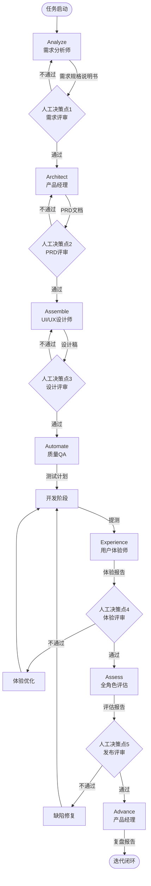

# 企业级数字员工系统设置方案

## 一、系统概述

本方案基于6A+1工作流（Analyze → Architect → Assemble → Automate → **Experience** → Assess → Advance），构建一套包含5个数字员工角色的企业级工作流程系统。

> **6A+1 说明**：在传统6A工作流基础上，增加了 **Experience（体验）** 节点，由用户体验师在测试完成后、发布前进行深度体验评估，确保产品不仅"能用"，更要"好用"。

## 二、6A+1 工作流架构

```
┌─────────────────────────────────────────────────────────────────────────┐
│                        6A+1 工作流                                       │
├─────────────────────────────────────────────────────────────────────────┤
│                                                                         │
│   ┌──────────┐    ┌──────────┐    ┌──────────┐    ┌──────────┐         │
│   │ Analyze  │───→│ Architect│───→│ Assemble │───→│ Automate │         │
│   │  分析    │    │  架构    │    │  组装    │    │  自动化  │         │
│   └──────────┘    └──────────┘    └──────────┘    └──────────┘         │
│        ↑                                                 │              │
│        │    ┌──────────┐    ┌──────────┐    ┌──────────┐│              │
│        └────│ Advance  │←───│ Assess   │←───│Experience││              │
│             │  进阶    │    │  评估    │    │  体验    ││              │
│             └──────────┘    └──────────┘    └──────────┘│              │
│                                                           │              │
└─────────────────────────────────────────────────────────────────────────┘
```

## 三、数字员工角色体系

### 3.1 角色总览

| 角色 | 英文名 | 工作流节点 | 核心输出 | 触发时机 |
|------|--------|------------|----------|----------|
| 需求分析师 | BA | Analyze | 需求规格说明书 | 新项目启动、需求变更 |
| 产品经理 | PM | Architect | PRD文档 | 需求分析完成后 |
| UI/UX设计师 | Designer | Assemble | 设计稿+规范 | PRD评审通过后 |
| 质量QA | QA | Automate | 测试计划+报告 | 设计/开发完成后 |
| **用户体验师** | **UX** | **Experience** | **体验报告+建议** | **测试通过后、发布前** |

### 3.2 角色职责矩阵

```
                    ┌─────────────────────────────────────────────────────────────────────┐
                    │                    项目阶段                                          │
┌───────────────────┼──────────┬──────────┬──────────┬──────────┬──────────┬──────────┤
│     角色/职责     │  需求    │  设计    │  开发    │  测试    │  体验    │   发布   │
├───────────────────┼──────────┼──────────┼──────────┼──────────┼──────────┼──────────┤
│                   │ ● 需求收集│          │          │          │          │          │
│   需求分析师      │ ● 需求分析│ ○ 需求澄清│          │          │          │          │
│      (BA)         │ ● 文档输出│          │          │          │          │          │
├───────────────────┼──────────┼──────────┼──────────┼──────────┼──────────┼──────────┤
│                   │ ● 需求评审│ ● 方案设计│ ○ 技术评估│          │          │ ● 发布决策│
│   产品经理        │ ● 优先级排│ ● PRD输出│ ○ 进度跟踪│          │          │ ● 迭代规划│
│      (PM)         │ ● 路线图  │          │          │          │          │          │
├───────────────────┼──────────┼──────────┼──────────┼──────────┼──────────┼──────────┤
│                   │          │ ● 交互设计│          │          │          │          │
│   UI/UX设计师     │          │ ● 视觉设计│ ○ 设计走查│          │          │          │
│                   │          │ ● 规范输出│          │          │          │          │
├───────────────────┼──────────┼──────────┼──────────┼──────────┼──────────┼──────────┤
│                   │ ○ 可测试性│ ○ 测试策略│ ○ 自动化  │ ● 测试执行│          │ ● 质量评估│
│   质量QA          │   评估    │ ● 用例设计│   脚本   │ ● 缺陷管理│          │ ● 发布建议│
│                   │          │ ● 门禁定义│          │ ● 测试报告│          │          │
├───────────────────┼──────────┼──────────┼──────────┼──────────┼──────────┼──────────┤
│                   │          │          │          │ ○ 测试配合│ ● 深度体验│ ● 体验评估│
│   用户体验师      │          │          │          │          │ ● 问题发现│ ● 优化建议│
│      (UX)         │          │          │          │          │ ● 报告输出│          │
└───────────────────┴──────────┴──────────┴──────────┴──────────┴──────────┴──────────┘

图例：● 主要职责  ○ 协作职责
```

## 四、工作流节点详解

### 4.1 节点流转图



### 4.2 人工决策点说明

| 决策点 | 决策时机 | 决策内容 | 参与角色 | 输出 |
|--------|----------|----------|----------|------|
| D1 | Analyze后 | 需求范围、目标对齐 | BA+PM+业务方 | 需求确认书 |
| D2 | Architect后 | 产品方案、优先级 | PM+设计师+开发 | PRD确认书 |
| D3 | Assemble后 | 设计方案、用户体验 | 设计师+PM | 设计确认书 |
| D4 | Experience后 | 体验质量、发布建议 | UX+PM+QA | 体验确认书 |
| D5 | Assess后 | 发布决策Go/No-Go | 全角色+决策者 | 发布决议 |

## 五、使用指南

### 5.1 完整工作流启动

```bash
# 方式1：使用协调系统
@数字员工协调系统 启动完整6A工作流，项目：[项目名称]

# 方式2：逐步启动
@需求分析师 分析需求：[需求描述]
# 等待人工决策后
@产品经理 基于需求制定PRD
# 等待人工决策后
@UI-UX设计师 基于PRD进行设计
# 等待人工决策后
@质量QA 制定测试策略
```

### 5.2 单角色调用

```bash
# 仅需求分析
@需求分析师 帮我分析这个需求：...

# 仅产品设计
@产品经理 基于以下需求写PRD：...

# 仅界面设计
@UI-UX设计师 设计一个登录页面

# 仅质量保障
@质量QA 为以下功能设计测试用例：...
```

### 5.3 多角色协作

```bash
# PM+设计师协作
@产品经理 + @UI-UX设计师 协作完成购物车功能设计

# 全角色评估
@数字员工协调系统 召开评审会议，评估当前版本质量
```

## 六、输出物标准

### 6.1 文档模板清单

| 文档类型 | 模板位置 | 编写角色 | 评审角色 |
|----------|----------|----------|----------|
| 需求规格说明书 | SKILL.md | BA | PM+业务方 |
| PRD文档 | SKILL.md | PM | 设计师+开发 |
| 设计规范文档 | SKILL.md | 设计师 | PM+前端 |
| 测试计划 | SKILL.md | QA | PM+开发 |

### 6.2 质量门禁标准

#### 准入标准（进入下一阶段前）
- [ ] 上一阶段输出物完整
- [ ] 评审会议已召开
- [ ] 问题已记录并分配
- [ ] 决策人已签字确认

#### 准出标准（发布前）
- [ ] 测试用例执行通过率 > 95%
- [ ] P0/P1缺陷修复率 100%
- [ ] 性能指标达标
- [ ] 安全扫描无高危漏洞
- [ ] 产品验收通过
- [ ] 发布评审会议通过

## 七、项目结构

```
.trae/
└── skills/
    ├── 数字员工协调系统/     # 协调多个角色
    │   └── SKILL.md
    ├── 需求分析师/           # BA角色
    │   └── SKILL.md
    ├── 产品经理/             # PM角色
    │   └── SKILL.md
    ├── UI-UX设计师/          # 设计师角色
    │   └── SKILL.md
    ├── 质量QA/               # QA角色
    │   └── SKILL.md
    └── 用户体验师/           # UX角色（新增）
        └── SKILL.md
```

## 八、快速开始

### 8.1 启动完整流程

```bash
# 启动一个完整的项目
@数字员工协调系统 启动完整6A+1工作流，项目名称：智能办公助手

系统会依次执行：
1. Analyze - 需求分析师分析需求
2. 【人工决策】确认需求范围
3. Architect - 产品经理输出PRD
4. 【人工决策】确认产品方案
5. Assemble - 设计师输出设计
6. 【人工决策】确认设计方案
7. Automate - QA制定测试策略
8. Experience - 用户体验师深度体验
9. 【人工决策】确认体验质量
10. Assess - 全角色评估
11. 【人工决策】发布决策
12. Advance - 产品经理复盘
```

### 8.2 单角色快速调用

```bash
# 需求分析
@需求分析师 我要做一个电商小程序，需要支持商品展示、购物车、订单管理

# 产品设计
@产品经理 基于以下需求写PRD：...

# 界面设计
@UI-UX设计师 设计一个数据可视化仪表盘

# 质量保障
@质量QA 为登录功能设计测试用例

# 体验评估
@用户体验师 体验一下这个版本，输出体验报告
```

## 九、最佳实践

### 9.1 使用原则

1. **人工决策不可跳过**：每个决策点必须人工确认
2. **文档即契约**：输出物是各角色间的契约
3. **问题及时升级**：遇到阻塞立即升级，不要反复循环
4. **知识持续沉淀**：Advance阶段总结的经验要复用

### 9.2 协作规范

1. **上游输出，下游输入**：严格按工作流顺序执行
2. **变更走流程**：需求变更需重新走Analyze节点
3. **问题可追溯**：所有决策和问题要记录
4. **质量共担**：质量是所有人的责任，不只是QA

### 9.3 效率提升

1. **模板复用**：建立常用需求模板
2. **自动化测试**：核心流程自动化
3. **并行工作**：非依赖任务可并行
4. **持续优化**：定期回顾Advance输出

## 十、故障处理

### 10.1 常见问题

| 问题 | 原因 | 解决方案 |
|------|------|----------|
| 需求反复修改 | 需求不明确 | 加强Analyze阶段，充分调研 |
| 设计还原度低 | 设计规范不清 | 完善设计规范文档 |
| 测试覆盖不足 | 用例设计不全 | 使用用例设计方法 |
| 发布延期 | 风险评估不足 | 加强Advance阶段规划 |

### 10.2 升级机制

```
节点卡壳 → 引入其他角色协助 → 仍无法解决 → 人工介入决策
    ↓
决策分歧 → 补充信息 → 仍无法达成一致 → 升级至决策者
    ↓
质量不达标 → 返回对应节点 → 仍不达标 → 评估是否接受/延期
```

## 十一、进阶配置

### 11.1 扩展角色

可根据需要扩展更多角色：
- 技术架构师（Technical Architect）
- 数据分析师（Data Analyst）
- 运维工程师（DevOps）
- 安全专家（Security Expert）

### 11.2 自定义工作流

可在6A基础上扩展：
- 增加预研阶段（Research）
- 增加技术方案评审（Technical Review）
- 增加灰度发布（Canary Release）

### 11.3 集成外部工具

- **项目管理**：Jira、飞书项目
- **文档协作**：飞书文档、Confluence
- **设计协作**：Figma、蓝湖
- **代码管理**：GitLab、GitHub
- **CI/CD**：Jenkins、GitLab CI

## 十二、总结

本数字员工系统通过：
- **标准化**：6A工作流规范执行
- **专业化**：4个独立角色各司其职
- **可视化**：清晰的流转和决策点
- **可追溯**：完整的文档和记录

帮助企业建立高效、规范、可复用的工作流程，提升团队协作效率和产品质量。

---

**版本**：v1.0  
**更新日期**：2026-03-26  
**作者**：AI助手